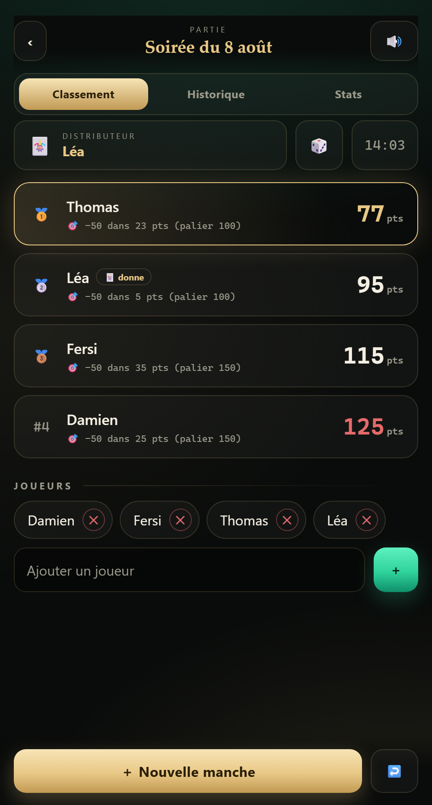
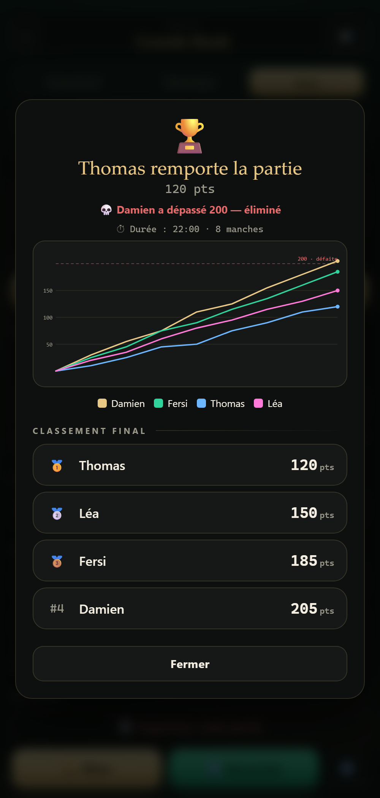

# 🏆 Yaniv Club

Application web **mono-fichier** pour suivre le score d'une partie de **Yaniv** — sans compte, sans serveur, hors-ligne, sur n'importe quel téléphone ou navigateur.

👉 **Jouer maintenant : https://coretc.github.io/yaniv-club/** (ou télécharger `index.html` et l'ouvrir dans un navigateur).

## Aperçu

| Partie en cours | Bilan & graphe |
|:---:|:---:|
|  |  |

## Fonctionnalités

- 📚 **Bibliothèque de parties** : enregistrer, reprendre, renommer, supprimer plusieurs parties (sauvegarde auto dans le navigateur).
- ☠️ **Élimination progressive** : dépasser la limite **élimine** le joueur, mais la partie continue — elle ne s'achève que lorsqu'il ne reste qu'**un seul survivant**. Les éliminés sont automatiquement retirés des manches suivantes et de la distribution.
- 🃏 **Distributeur** tiré au sort au départ, puis rotation dans l'ordre des joueurs (les éliminés sont sautés).
- 🎯 **Paliers −50** automatiques (50 / 100 / 150 / 200). Atterrir pile sur la limite redescend de 50 ; on ne perd qu'en **dépassant**.
- 🗣️ **Annonce vocale** des scores et du distributeur (voix féminine, sélecteur de voix).
- ✏️ **Correction** de n'importe quelle manche, ↩️ annulation, ⏱️ chrono de partie.
- 📈 **Rapport** graphique (trajectoire des scores, manches en abscisse) + 🎖️⚔️⤵️ **détail par manche** + 🏁 bilan de fin de partie.
- 🏆 **Palmarès du groupe** (victoires / défaites / moyenne, toutes parties confondues).
- ⚙️ **Règles configurables** (limite, valeur de l'Asaf, paliers, « Yaniv = 0 »).
- 💾 **Sauvegarde renforcée** (sans compte, hors-ligne) : sauvegarde auto locale + miroir de secours. Sauvegarde/restauration de **toutes** tes parties par **presse-papier** (copier / coller — idéal PC) ou par **fichier `.json`**.
- 📲 **Transfert entre appareils par QR ou lien** : la partie en cours s'encode en QR (payload compact) — l'autre téléphone la scanne et l'importe toute seule ; repli sur le lien si la partie est trop grande.
- 🎉 Confettis, retour haptique, installable sur l'écran d'accueil.

## Technique

Un seul fichier `index.html` (HTML + CSS + JS, zéro dépendance). Les données restent **en local** dans le `localStorage` de ton navigateur — rien n'est envoyé nulle part.

## Licence

MIT — fais-en ce que tu veux.
